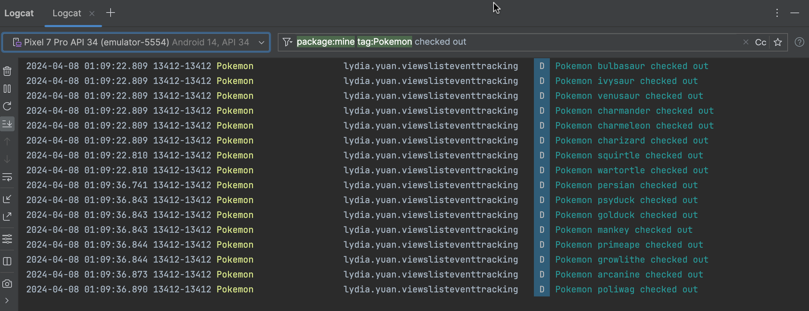

# Event Tracking with RecyclerView / LazyList

This is a simple demo of do event tracking with RecyclerView /LazyList and Pokemon GraphQL API, both add pagination using Jetpack Paging 3.

## Demo

### UI


### Event Tracking ( Logging to Logcat )



If the list item is entirely visible for more than 2 seconds, it will be logged to Logcat.

## RecyclerView

The code is in the [`views`](./views/) folder.

We can easily handle the visibility part with `onViewAttachedToWindow` and `onViewDetachedFromWindow` methods.

```kotlin
class PokemonAdapter: PagingDataAdapter<GetPokemonsQuery.Result, PokemonAdapter.ViewHolder>(POST_COMPARATOR) {

    ......

    private val timers: MutableMap<Int, Job?> = mutableMapOf()

    private val DELAY = 2000L

    override fun onViewAttachedToWindow(holder: ViewHolder) {
        super.onViewAttachedToWindow(holder)
        val position = holder.bindingAdapterPosition
        startTimerForItem(position)
    }

    override fun onViewDetachedFromWindow(holder: ViewHolder) {
        super.onViewDetachedFromWindow(holder)
        val position = holder.bindingAdapterPosition
        stopTimerForItem(position)
    }

    private fun startTimerForItem(position: Int) {
        val job = CoroutineScope(Dispatchers.Main).launch {
            delay(DELAY)
            // Timer finished logic
            val pokemon = getItem(position)
            pokemon?.id?.let { id ->
                if (!isPokemonCheckedOut(id)) {
                    // If the Pokemon has not been checked out before, first record the id then log the checkout
                    checkoutPokemon(id)
                    logPokemonCheckout(pokemon)
                }
            }
        }
        timers[position] = job
    }

    private fun stopTimerForItem(position: Int) {
        timers[position]?.cancel()
        timers.remove(position)
    }

    ......
}
```

## LazyList

The code is in the [`compose`](./compose/) folder.

It's a bit tricky but still doable with `LazyListState`.

```kotlin
fun isPokemonVisibleInLazyList(
    lazyListState: LazyListState,
    pokemon: GetPokemonsQuery.Result
): State<Boolean> {
    return derivedStateOf {
        lazyListState.layoutInfo.visibleItemsInfo.any { it.index == pokemon.id }
    }
}


@Composable
fun PokemonList() {
    val pokemonViewModel: PokemonViewModel = hiltViewModel()
    val lazyPagingItems = pokemonViewModel.pokemons.collectAsLazyPagingItems()

    val lazyListState = rememberLazyListState()

    LazyColumn(
        state = lazyListState
    ) {
        items(
            count = lazyPagingItems.itemCount,
            key = lazyPagingItems.itemKey { it.id ?: 0 }
        ) { index ->
            PokemonItem(
                pokemon = lazyPagingItems[index]!!,
                isVisibleInTheLazyList = isPokemonVisibleInLazyList(
                    lazyListState,
                    lazyPagingItems[index]!!
                ).value
            )
        }
    }
}

@Composable
fun PokemonItem(pokemon: GetPokemonsQuery.Result, isVisibleInTheLazyList: Boolean) {

    var timerJob by remember { mutableStateOf<Job?>(null) }

    val pokemonViewModel: PokemonViewModel = hiltViewModel()

    // automatically cancel the timer when the item is removed from the list
    val scope = rememberCoroutineScope()

    LaunchedEffect(isVisibleInTheLazyList) {
        if (isVisibleInTheLazyList) {
            timerJob = startTimerForItem(
                scope = scope,
                pokemon = pokemon,
                isPokemonCheckedOut = pokemonViewModel::isPokemonCheckedOut,
                checkoutPokemon = pokemonViewModel::checkoutPokemon,
                logPokemonCheckout = pokemonViewModel::logPokemonCheckout
            )
        } else {
            timerJob?.cancel()
        }
    }

    
    ......
}

private fun startTimerForItem(
    scope: CoroutineScope,
    pokemon: GetPokemonsQuery.Result,
    isPokemonCheckedOut: (Int) -> Boolean,
    checkoutPokemon: (Int) -> Unit,
    logPokemonCheckout: (GetPokemonsQuery.Result) -> Unit
): Job {
    return scope.launch {
        delay(DELAY)
        pokemon.id?.let { id ->
            if (!isPokemonCheckedOut(id)) {
                // If the Pokemon has not been checked out before, first record the id then log the checkout
                checkoutPokemon(id)
                logPokemonCheckout(pokemon)
            }
        }
    }
}

private const val DELAY = 2000L
```